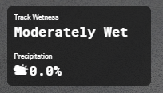

# Описание

Weather App для Kapps. Сделано на основе [iRacing Browser Apps ](https://ir-apps.kutu.ru/).

Показывает "влажность трека" и "осадки"

Осадки это насколько идет дождь. Вроде как именно на страт-финиш линии. Я подозреваю тоже что и радар (не шанс дождя). Но замечал различия с радаром. Так что оно что-то показывает, но не понятно что точно.

# Установка

- Создать папку на которую Kapps сделает ссылку
(Рекомендую сделать в документах iRacing папку CustomApps, чтобы не потерять)

- Извлечь папку приложения WeatherApp.
    Должно выглядеть как: Documents\iRacing\CustomApps\WeatherApp. В "WeatherApp" папки 'libs', 'css' и 'fonts'; файлы 'app.coffee' и 'index.html'

- Запустить Kapps от администратора (Kapps нужно создать symlink). Во вкладке 'App' открыть 'Settings'. Добавить папку в 'App Folder'. Нужно выбрать ту что создали на первом шаге (CustomApps). И сохранить 'Save'
    Чтобы проверить что сработало, перейти в `%AppData%\Kapps\iRacingBrowserApps`. Там должен быть ярлык 'apps', который ведет в нашу папку. Если нет, попробовать еще раз закрыть и запустить Kapps от админа. Или сделать вручную, гугл в помощь.

- Перейти в 'Racing Overlay'. Пролистать вниз и добавить 'Add Custom Overlay'. Ввести имя, путь и поставить нужные галки ('not in iRacing' наверняка)
    - Название может быть любым
    - URL должно быть 'http://127.0.0.1:8182/WeatherApp/'

Теперь можно открыть оверлей и настроить новый квадратик.

# Description

Weather App for Kapps. Based on [iRacing Browser Apps ](https://ir-apps.kutu.ru/).

Shows 'track wetness' and 'precipitation'

Precipitation is how much its rains. On start-finish line. My guess its mirrors radar (not a chance of rain). But notice some difference with radar. So its showing something, but don't understand what exactly.

# Install

- Make folder that Kapps will make link.
(Recommend in iRacing document make folder CustomApps, so not to lost it.)

- Extract app folder WeatherApp.
    Should look like: Documents\iRacing\CustomApps\WeatherApp. In WeatherApp should be folders 'libs', 'css' and 'fonts'; files 'app.coffee' and 'index.html'
    
- Run Kapps with admin (Kapps need to create symlink). In tab 'App' open 'Settings'. Add folder to 'App Folder'. Need to select folder that in first step (CustomApps). And 'Save'
    To check if it worked, got to folder `%AppData%\Kapps\iRacingBrowserApps`. There should be shortcut 'apps' that leads to our folder. If not, try close and run Kapps as admin again. Or make it yourself, google will help.

- Go to 'Racing Overlay'. Scroll down and 'Add Custom Overlay'. Enter name, url and tick boxes what needed ('not in iRacing' for sure)
    - Name can be any.
    - URL must be 'http://127.0.0.1:8182/WeatherApp/'

Now you can open overlay in edit new box.

--------
Author: Rovlgut